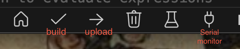

# Wearable Pulse Tracker

This project uses an ESP32 with a pulse sensor to track visitors' heartbeats in an exhibition. Pulse data is sent to a Supabase backend for visualization.

## Features

- Capture pulse using PulseSensor
- Send data to Supabase via HTTP
- Optional LED feedback for heartbeat
- Data stored per visitor session

## Hardware

- ESP32 Dev Kit
- PulseSensor.com sensor
- Optional NFC module

## Software

- PlatformIO / Arduino Framework
- Supabase backend
- VS Code for development

## Setup

1. Make sure that you have the extension PlatformIO IDE installed and enabled
2. Connect the pulse sensor:
   - 3V3 → 3V
   - GND → GND
   - Signal → GPIO34
3. Update `ssid` and `password` in `main.cpp` for your Wi-Fi.
4. Update `SUPABASE_URL` and `SUPABASE_ANON_KEY` with your Supabase project details.
5. Compile and upload via PlatformIO.

NB: You will probably need to add the following code to the Pulse Sensor Playground file. You can find it in .pio -> libdeps/esp32dev -> PulseSensor Playground -> src -> PulseSensorPlayground.cpp. 

On line 48 add:

 `bool PulseSensorPlayground::begin() (and delete other code)`
 
 and on line 493 replace the exisiting code with this: 

 ```// Use the Arduino-ESP32 timer API: timerBegin(timer_number, prescaler, countUp)
    // With APB clock 80MHz, prescaler 80 yields a 1MHz tick (1us period).
    sampleTimer = timerBegin(0, 80, true); // timer 0, 1uS tick period
    timerAttachInterrupt(sampleTimer, &onInterrupt, true);
    // Set alarm for 2000 ticks = 2000us (2ms -> 500Hz) and enable it
    timerAlarmWrite(sampleTimer, 2000, true);
    timerAlarmEnable(sampleTimer);
```

6. Then first build your code by clicking the tick sign as shown in the below picture, you then upload it using the below arrow to the right and then you click the weird plug symbol to open the serial monitor



## Using fake data

To use the fake data you need to do the above steps (connect the ESP32, make sure supabase credentials are in there) but we aren't using PulseSensorPlayground so you can forget that. Something that you might have to do is make sure you are on the correct port. To do this click Command + Shift + P and search for 'PlatformIO - Set Project Port' and there select cu.usbserial.0001. You should now see this at the bottom of your screen

## Notes

- Do not commit `.pio` or `.vscode` folders.
- Use `.gitignore` and make sure this is in it: 

``` Supabase:
.branches
.temp

dotenvx:
.env.keys
.env.local
.env.*.local

.pio/
.vscode/
*.bin
*.elf
*.pioenvs/

 Mac / System files:
.DS_Store

src/frontend/node_modules/

